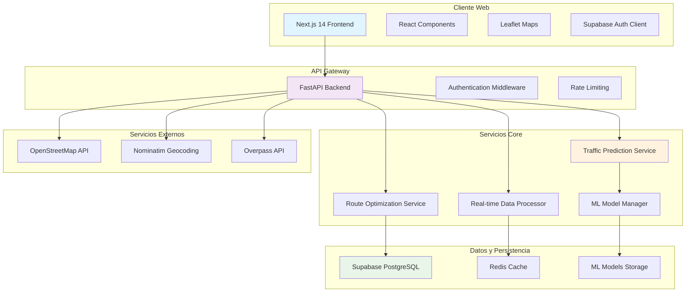

# Diseño del Sistema PrediRuta - Sistema Web de Predicción del Tráfico Vehicular con IA

## Enfoque de Implementación

Analizaremos los puntos difíciles de los requerimientos y seleccionaremos el framework open-source apropiado:

### Puntos Críticos del Sistema:
1. **Predicción de Tráfico en Tiempo Real**: Requiere procesamiento eficiente de grandes volúmenes de datos geoespaciales
2. **Integración de Mapas Interactivos**: Necesidad de renderizado fluido de mapas con capas de tráfico
3. **Motor de IA Escalable**: Modelo de machine learning que mejore continuamente con nuevos datos
4. **Arquitectura Distribuida**: Sistema que maneje múltiples servicios de forma coordinada

### Framework Seleccionado:
- **Frontend**: Next.js 14 con App Router para SSR optimizado y mejor SEO
- **Backend**: FastAPI por su alto rendimiento, documentación automática y soporte nativo para async/await
- **Base de Datos**: Supabase PostgreSQL con PostGIS para consultas geoespaciales eficientes
- **ML Framework**: scikit-learn por su simplicidad y robustez para modelos de regresión
- **Mapas**: Leaflet por ser lightweight y altamente personalizable
- **Contenedores**: Docker para consistencia entre entornos de desarrollo y producción

## Arquitectura General del Sistema



## Diseño del Frontend

### Estructura de Componentes Next.js 14

```
src/
├── app/
│   ├── layout.tsx                 # Layout principal con providers
│   ├── page.tsx                   # Página de inicio - consulta de rutas
│   ├── dashboard/
│   │   └── page.tsx              # Dashboard de tráfico por zona
│   ├── profile/
│   │   └── page.tsx              # Perfil de usuario y rutas favoritas
│   ├── api/
│   │   └── auth/
│   │       └── route.ts          # Proxy para autenticación
│   └── globals.css               # Estilos globales con Tailwind
├── components/
│   ├── ui/                       # Componentes base reutilizables
│   │   ├── Button.tsx
│   │   ├── Input.tsx
│   │   ├── Modal.tsx
│   │   └── LoadingSpinner.tsx
│   ├── map/                      # Componentes de mapas
│   │   ├── MapContainer.tsx      # Contenedor principal del mapa
│   │   ├── RouteLayer.tsx        # Capa de rutas
│   │   ├── TrafficLayer.tsx      # Capa de tráfico
│   │   └── MarkerCluster.tsx     # Agrupación de marcadores
│   ├── route/                    # Componentes de rutas
│   │   ├── RouteSearch.tsx       # Formulario de búsqueda
│   │   ├── RouteResults.tsx      # Lista de resultados
│   │   └── RouteCard.tsx         # Tarjeta individual de ruta
│   ├── auth/                     # Componentes de autenticación
│   │   ├── LoginForm.tsx
│   │   ├── SignUpForm.tsx
│   │   └── AuthProvider.tsx
│   └── layout/                   # Componentes de layout
│       ├── Header.tsx
│       ├── Navigation.tsx
│       └── Footer.tsx
├── hooks/                        # Custom hooks
│   ├── useAuth.ts               # Hook para autenticación
│   ├── useMap.ts                # Hook para gestión de mapas
│   ├── useRoutes.ts             # Hook para rutas
│   └── useTraffic.ts            # Hook para datos de tráfico
├── lib/
│   ├── supabase.ts              # Cliente Supabase
│   ├── api.ts                   # Cliente API
│   ├── utils.ts                 # Utilidades generales
│   └── types.ts                 # Definiciones de tipos TypeScript
└── store/                       # Gestión de estado
    ├── authStore.ts             # Estado de autenticación
    ├── mapStore.ts              # Estado del mapa
    └── routeStore.ts            # Estado de rutas
```

### Componentes Principales

#### MapContainer.tsx
```typescript
interface MapContainerProps {
  routes: Route[];
  trafficData: TrafficData[];
  center: [number, number];
  zoom: number;
  onRouteSelect: (route: Route) => void;
}

export function MapContainer({ 
  routes, 
  trafficData, 
  center, 
  zoom, 
  onRouteSelect 
}: MapContainerProps) {
  // Implementación con Leaflet
}
```

#### RouteSearch.tsx
```typescript
interface RouteSearchProps {
  onSearch: (origin: string, destination: string, departureTime: Date) => void;
  loading: boolean;
}

export function RouteSearch({ onSearch, loading }: RouteSearchProps) {
  // Formulario con autocompletado usando Nominatim
}
```

### Configuración de Supabase

```typescript
// lib/supabase.ts
import { createClientComponentClient } from '@supabase/auth-helpers-nextjs'

export const supabase = createClientComponentClient({
  supabaseUrl: process.env.NEXT_PUBLIC_SUPABASE_URL!,
  supabaseKey: process.env.NEXT_PUBLIC_SUPABASE_ANON_KEY!,
})

// Tipos de base de datos
export interface Database {
  public: {
    Tables: {
      users: {
        Row: User;
        Insert: Omit<User, 'id' | 'created_at'>;
        Update: Partial<User>;
      };
      favorite_routes: {
        Row: FavoriteRoute;
        Insert: Omit<FavoriteRoute, 'id' | 'created_at'>;
        Update: Partial<FavoriteRoute>;
      };
      // ... más tablas
    };
  };
}
```

## Diseño del Backend

### Estructura FastAPI

```
backend/
├── app/
│   ├── __init__.py
│   ├── main.py                   # Aplicación principal FastAPI
│   ├── core/
│   │   ├── config.py            # Configuración de la aplicación
│   │   ├── security.py          # Autenticación y autorización
│   │   └── database.py          # Conexión a base de datos
│   ├── api/
│   │   ├── __init__.py
│   │   ├── deps.py              # Dependencias comunes
│   │   └── v1/
│   │       ├── __init__.py
│   │       ├── endpoints/
│   │       │   ├── health.py    # Endpoint de salud
│   │       │   ├── auth.py      # Autenticación
│   │       │   ├── routes.py    # Sugerencia de rutas
│   │       │   ├── traffic.py   # Predicción de tráfico
│   │       │   └── users.py     # Gestión de usuarios
│   │       └── api.py           # Router principal
│   ├── services/
│   │   ├── __init__.py
│   │   ├── traffic_prediction.py # Servicio de predicción
│   │   ├── route_optimization.py # Optimización de rutas
│   │   ├── data_ingestion.py    # Ingesta de datos
│   │   └── ml_model.py          # Gestión de modelos ML
│   ├── models/
│   │   ├── __init__.py
│   │   ├── user.py              # Modelo de usuario
│   │   ├── route.py             # Modelo de ruta
│   │   ├── traffic.py           # Modelo de tráfico
│   │   └── prediction.py        # Modelo de predicción
│   ├── schemas/
│   │   ├── __init__.py
│   │   ├── user.py              # Esquemas Pydantic usuario
│   │   ├── route.py             # Esquemas de ruta
│   │   ├── traffic.py           # Esquemas de tráfico
│   │   └── prediction.py        # Esquemas de predicción
│   └── utils/
│       ├── __init__.py
│       ├── geocoding.py         # Utilidades de geocodificación
│       ├── osm_client.py        # Cliente OpenStreetMap
│       └── validators.py        # Validadores personalizados
├── ml_models/                   # Modelos ML persistidos
│   ├── traffic_predictor.joblib
│   └── route_optimizer.joblib
├── requirements.txt
├── Dockerfile
└── docker-compose.yml
```

### Endpoints de API

#### main.py
```python
from fastapi import FastAPI, Middleware
from fastapi.middleware.cors import CORSMiddleware
from app.api.v1.api import api_router
from app.core.config import settings

app = FastAPI(
    title="PrediRuta API",
    description="Sistema de Predicción del Tráfico Vehicular con IA",
    version="1.0.0"
)

app.add_middleware(
    CORSMiddleware,
    allow_origins=settings.ALLOWED_HOSTS,
    allow_credentials=True,
    allow_methods=["*"],
    allow_headers=["*"],
)

app.include_router(api_router, prefix="/api/v1")

@app.get("/")
async def root():
    return {"message": "PrediRuta API v1.0.0"}
```

#### endpoints/health.py
```python
from fastapi import APIRouter, Depends
from app.services.ml_model import MLModelService

router = APIRouter()

@router.get("/health")
async def health_check():
    """Endpoint de verificación de salud del sistema"""
    return {
        "status": "healthy",
        "timestamp": datetime.utcnow(),
        "version": "1.0.0"
    }

@router.get("/health/ml")
async def ml_health_check(ml_service: MLModelService = Depends()):
    """Verificación de salud de los modelos ML"""
    model_status = await ml_service.check_model_health()
    return {
        "ml_models": model_status,
        "status": "healthy" if all(model_status.values()) else "degraded"
    }
```

#### endpoints/traffic.py
```python
from fastapi import APIRouter, Depends, HTTPException
from app.schemas.traffic import TrafficPredictionRequest, TrafficPredictionResponse
from app.services.traffic_prediction import TrafficPredictionService

router = APIRouter()

@router.post("/predict-traffic", response_model=TrafficPredictionResponse)
async def predict_traffic(
    request: TrafficPredictionRequest,
    service: TrafficPredictionService = Depends()
):
    """Predice el tráfico para una ubicación y tiempo específicos"""
    try:
        prediction = await service.predict_traffic(
            lat=request.latitude,
            lon=request.longitude,
            timestamp=request.timestamp,
            road_type=request.road_type
        )
        return TrafficPredictionResponse(
            traffic_level=prediction.traffic_level,
            confidence=prediction.confidence,
            estimated_speed=prediction.estimated_speed,
            congestion_probability=prediction.congestion_probability
        )
    except Exception as e:
        raise HTTPException(status_code=500, detail=str(e))

@router.get("/traffic/current")
async def get_current_traffic(
    bounds: str,  # "lat1,lon1,lat2,lon2"
    service: TrafficPredictionService = Depends()
):
    """Obtiene el estado actual del tráfico en un área específica"""
    try:
        bounds_coords = [float(x) for x in bounds.split(',')]
        traffic_data = await service.get_current_traffic(bounds_coords)
        return {"traffic_zones": traffic_data}
    except Exception as e:
        raise HTTPException(status_code=400, detail="Invalid bounds format")
```

#### endpoints/routes.py
```python
from fastapi import APIRouter, Depends, HTTPException
from app.schemas.route import RouteRequest, RouteResponse
from app.services.route_optimization import RouteOptimizationService

router = APIRouter()

@router.post("/routes/suggest", response_model=List[RouteResponse])
async def suggest_routes(
    request: RouteRequest,
    service: RouteOptimizationService = Depends()
):
    """Sugiere rutas optimizadas entre origen y destino"""
    try:
        routes = await service.calculate_optimal_routes(
            origin=request.origin,
            destination=request.destination,
            departure_time=request.departure_time,
            preferences=request.preferences
        )
        return [
            RouteResponse(
                route_id=route.id,
                geometry=route.geometry,
                distance=route.distance,
                estimated_duration=route.estimated_duration,
                traffic_level=route.traffic_level,
                route_type=route.route_type
            )
            for route in routes
        ]
    except Exception as e:
        raise HTTPException(status_code=500, detail=str(e))
```

## Esquemas de Base de Datos

### Tablas Principales en Supabase PostgreSQL

```sql
-- Extensiones necesarias
CREATE EXTENSION IF NOT EXISTS "uuid-ossp";
CREATE EXTENSION IF NOT EXISTS "postgis";

-- Tabla de usuarios (extendida de Supabase Auth)
CREATE TABLE public.user_profiles (
    id UUID REFERENCES auth.users(id) PRIMARY KEY,
    email VARCHAR(255) UNIQUE NOT NULL,
    full_name VARCHAR(255),
    avatar_url TEXT,
    preferences JSONB DEFAULT '{}',
    created_at TIMESTAMP WITH TIME ZONE DEFAULT NOW(),
    updated_at TIMESTAMP WITH TIME ZONE DEFAULT NOW()
);

-- Tabla de rutas favoritas
CREATE TABLE public.favorite_routes (
    id UUID DEFAULT uuid_generate_v4() PRIMARY KEY,
    user_id UUID REFERENCES public.user_profiles(id) ON DELETE CASCADE,
    name VARCHAR(255) NOT NULL,
    origin_name VARCHAR(255) NOT NULL,
    origin_coords GEOMETRY(POINT, 4326) NOT NULL,
    destination_name VARCHAR(255) NOT NULL,
    destination_coords GEOMETRY(POINT, 4326) NOT NULL,
    preferences JSONB DEFAULT '{}',
    created_at TIMESTAMP WITH TIME ZONE DEFAULT NOW(),
    updated_at TIMESTAMP WITH TIME ZONE DEFAULT NOW()
);

-- Tabla de logs de consultas
CREATE TABLE public.route_queries (
    id UUID DEFAULT uuid_generate_v4() PRIMARY KEY,
    user_id UUID REFERENCES public.user_profiles(id) ON DELETE SET NULL,
    session_id VARCHAR(255),
    origin_coords GEOMETRY(POINT, 4326) NOT NULL,
    destination_coords GEOMETRY(POINT, 4326) NOT NULL,
    departure_time TIMESTAMP WITH TIME ZONE,
    query_time TIMESTAMP WITH TIME ZONE DEFAULT NOW(),
    response_time_ms INTEGER,
    routes_returned INTEGER,
    preferences JSONB DEFAULT '{}'
);

-- Tabla de datos históricos de tráfico
CREATE TABLE public.traffic_data (
    id UUID DEFAULT uuid_generate_v4() PRIMARY KEY,
    location GEOMETRY(POINT, 4326) NOT NULL,
    road_segment_id VARCHAR(255),
    timestamp TIMESTAMP WITH TIME ZONE NOT NULL,
    speed_kmh DECIMAL(5,2),
    traffic_level INTEGER CHECK (traffic_level BETWEEN 1 AND 5),
    vehicle_count INTEGER,
    congestion_factor DECIMAL(3,2),
    weather_conditions JSONB,
    created_at TIMESTAMP WITH TIME ZONE DEFAULT NOW()
);

-- Tabla de segmentos de carretera
CREATE TABLE public.road_segments (
    id VARCHAR(255) PRIMARY KEY,
    name VARCHAR(255),
    geometry GEOMETRY(LINESTRING, 4326) NOT NULL,
    road_type VARCHAR(50),
    speed_limit INTEGER,
    lanes INTEGER,
    surface_type VARCHAR(50),
    created_at TIMESTAMP WITH TIME ZONE DEFAULT NOW(),
    updated_at TIMESTAMP WITH TIME ZONE DEFAULT NOW()
);

-- Tabla de predicciones de tráfico
CREATE TABLE public.traffic_predictions (
    id UUID DEFAULT uuid_generate_v4() PRIMARY KEY,
    road_segment_id VARCHAR(255) REFERENCES public.road_segments(id),
    prediction_time TIMESTAMP WITH TIME ZONE NOT NULL,
    target_time TIMESTAMP WITH TIME ZONE NOT NULL,
    predicted_speed DECIMAL(5,2),
    predicted_traffic_level INTEGER CHECK (predicted_traffic_level BETWEEN 1 AND 5),
    confidence_score DECIMAL(3,2),
    model_version VARCHAR(50),
    created_at TIMESTAMP WITH TIME ZONE DEFAULT NOW()
);

-- Índices para optimización de consultas geoespaciales
CREATE INDEX idx_favorite_routes_user_id ON public.favorite_routes(user_id);
CREATE INDEX idx_favorite_routes_origin_coords ON public.favorite_routes USING GIST(origin_coords);
CREATE INDEX idx_favorite_routes_destination_coords ON public.favorite_routes USING GIST(destination_coords);

CREATE INDEX idx_traffic_data_location ON public.traffic_data USING GIST(location);
CREATE INDEX idx_traffic_data_timestamp ON public.traffic_data(timestamp);
CREATE INDEX idx_traffic_data_road_segment ON public.traffic_data(road_segment_id);

CREATE INDEX idx_road_segments_geometry ON public.road_segments USING GIST(geometry);
CREATE INDEX idx_road_segments_type ON public.road_segments(road_type);

CREATE INDEX idx_traffic_predictions_segment_time ON public.traffic_predictions(road_segment_id, target_time);

-- Políticas de seguridad (Row Level Security)
ALTER TABLE public.user_profiles ENABLE ROW LEVEL SECURITY;
ALTER TABLE public.favorite_routes ENABLE ROW LEVEL SECURITY;
ALTER TABLE public.route_queries ENABLE ROW LEVEL SECURITY;

-- Política para user_profiles
CREATE POLICY "Users can view own profile" ON public.user_profiles
    FOR SELECT USING (auth.uid() = id);

CREATE POLICY "Users can update own profile" ON public.user_profiles
    FOR UPDATE USING (auth.uid() = id);

-- Política para favorite_routes
CREATE POLICY "Users can manage own favorite routes" ON public.favorite_routes
    FOR ALL USING (auth.uid() = user_id);

-- Política para route_queries
CREATE POLICY "Users can view own queries" ON public.route_queries
    FOR SELECT USING (auth.uid() = user_id);
```

## Arquitectura del Modelo de IA

### Servicio de Predicción de Tráfico

```python
# services/traffic_prediction.py
import joblib
import pandas as pd
import numpy as np
from sklearn.ensemble import RandomForestRegressor
from sklearn.preprocessing import StandardScaler
from sklearn.model_selection import train_test_split
from sklearn.metrics import mean_absolute_error, r2_score
from datetime import datetime, timedelta
import asyncio
from typing import List, Dict, Optional

class TrafficPredictionService:
    def __init__(self):
        self.model: Optional[RandomForestRegressor] = None
        self.scaler: Optional[StandardScaler] = None
        self.feature_columns = [
            'hour', 'day_of_week', 'month', 'is_weekend',
            'latitude', 'longitude', 'road_type_encoded',
            'historical_avg_speed', 'weather_factor'
        ]
        self.model_path = "ml_models/traffic_predictor.joblib"
        self.scaler_path = "ml_models/traffic_scaler.joblib"
        
    async def load_model(self):
        """Carga el modelo entrenado desde disco"""
        try:
            self.model = joblib.load(self.model_path)
            self.scaler = joblib.load(self.scaler_path)
            print("Modelo de predicción de tráfico cargado exitosamente")
        except FileNotFoundError:
            print("Modelo no encontrado, entrenando nuevo modelo...")
            await self.train_model()
    
    async def train_model(self, retrain: bool = False):
        """Entrena o re-entrena el modelo de predicción"""
        # Cargar datos históricos de la base de datos
        training_data = await self._load_training_data()
        
        if training_data.empty:
            print("No hay datos suficientes para entrenar el modelo")
            return
        
        # Preparar características (features)
        X = self._prepare_features(training_data)
        y = training_data['speed_kmh'].values
        
        # Dividir datos en entrenamiento y prueba
        X_train, X_test, y_train, y_test = train_test_split(
            X, y, test_size=0.2, random_state=42
        )
        
        # Normalizar características
        self.scaler = StandardScaler()
        X_train_scaled = self.scaler.fit_transform(X_train)
        X_test_scaled = self.scaler.transform(X_test)
        
        # Entrenar modelo RandomForest
        self.model = RandomForestRegressor(
            n_estimators=100,
            max_depth=20,
            min_samples_split=5,
            min_samples_leaf=2,
            random_state=42,
            n_jobs=-1
        )
        
        self.model.fit(X_train_scaled, y_train)
        
        # Evaluar modelo
        y_pred = self.model.predict(X_test_scaled)
        mae = mean_absolute_error(y_test, y_pred)
        r2 = r2_score(y_test, y_pred)
        
        print(f"Modelo entrenado - MAE: {mae:.2f}, R²: {r2:.3f}")
        
        # Guardar modelo y scaler
        joblib.dump(self.model, self.model_path)
        joblib.dump(self.scaler, self.scaler_path)
        
    def _prepare_features(self, data: pd.DataFrame) -> np.ndarray:
        """Prepara las características para el modelo"""
        features = pd.DataFrame()
        
        # Características temporales
        features['hour'] = data['timestamp'].dt.hour
        features['day_of_week'] = data['timestamp'].dt.dayofweek
        features['month'] = data['timestamp'].dt.month
        features['is_weekend'] = (data['timestamp'].dt.dayofweek >= 5).astype(int)
        
        # Características geográficas
        features['latitude'] = data['latitude']
        features['longitude'] = data['longitude']
        
        # Codificación de tipo de carretera
        road_type_mapping = {
            'highway': 1, 'arterial': 2, 'collector': 3, 
            'local': 4, 'residential': 5
        }
        features['road_type_encoded'] = data['road_type'].map(
            road_type_mapping
        ).fillna(0)
        
        # Características históricas
        features['historical_avg_speed'] = data['historical_avg_speed']
        
        # Factor climático (simplificado)
        features['weather_factor'] = data.get('weather_factor', 1.0)
        
        return features[self.feature_columns].values
    
    async def predict_traffic(
        self, 
        lat: float, 
        lon: float, 
        timestamp: datetime,
        road_type: str = "arterial"
    ) -> Dict:
        """Predice el tráfico para una ubicación y tiempo específicos"""
        if not self.model or not self.scaler:
            await self.load_model()
        
        # Preparar datos de entrada
        input_data = pd.DataFrame({
            'timestamp': [timestamp],
            'latitude': [lat],
            'longitude': [lon],
            'road_type': [road_type],
            'historical_avg_speed': [await self._get_historical_speed(lat, lon)],
            'weather_factor': [1.0]  # Simplificado por ahora
        })
        
        # Preparar características
        X = self._prepare_features(input_data)
        X_scaled = self.scaler.transform(X)
        
        # Realizar predicción
        predicted_speed = self.model.predict(X_scaled)[0]
        
        # Calcular nivel de tráfico basado en velocidad
        traffic_level = self._speed_to_traffic_level(predicted_speed)
        
        # Calcular confianza basada en varianza del modelo
        confidence = self._calculate_confidence(X_scaled)
        
        return {
            "predicted_speed": round(predicted_speed, 2),
            "traffic_level": traffic_level,
            "confidence": round(confidence, 3),
            "congestion_probability": self._calculate_congestion_prob(predicted_speed)
        }
    
    def _speed_to_traffic_level(self, speed: float) -> int:
        """Convierte velocidad a nivel de tráfico (1-5)"""
        if speed >= 50:
            return 1  # Fluido
        elif speed >= 40:
            return 2  # Ligero
        elif speed >= 25:
            return 3  # Moderado
        elif speed >= 15:
            return 4  # Pesado
        else:
            return 5  # Congestionado
    
    def _calculate_confidence(self, X: np.ndarray) -> float:
        """Calcula la confianza de la predicción"""
        # Usar la varianza de las predicciones de los árboles
        tree_predictions = np.array([
            tree.predict(X) for tree in self.model.estimators_
        ])
        variance = np.var(tree_predictions)
        # Convertir varianza a confianza (0-1)
        confidence = max(0, min(1, 1 - (variance / 100)))
        return confidence
    
    async def _get_historical_speed(self, lat: float, lon: float) -> float:
        """Obtiene la velocidad histórica promedio para una ubicación"""
        # Implementar consulta a base de datos
        # Por ahora retornar valor por defecto
        return 35.0
    
    def _calculate_congestion_prob(self, speed: float) -> float:
        """Calcula la probabilidad de congestión"""
        if speed <= 20:
            return 0.9
        elif speed <= 30:
            return 0.6
        elif speed <= 40:
            return 0.3
        else:
            return 0.1

# Servicio de gestión de modelos ML
class MLModelService:
    def __init__(self):
        self.traffic_predictor = TrafficPredictionService()
        self.last_training = None
        self.training_interval = timedelta(days=7)  # Re-entrenar semanalmente
    
    async def initialize(self):
        """Inicializa todos los modelos ML"""
        await self.traffic_predictor.load_model()
        self.last_training = datetime.now()
    
    async def check_model_health(self) -> Dict[str, bool]:
        """Verifica el estado de salud de los modelos"""
        return {
            "traffic_predictor": self.traffic_predictor.model is not None,
            "last_training": self.last_training.isoformat() if self.last_training else None,
            "needs_retraining": self._needs_retraining()
        }
    
    def _needs_retraining(self) -> bool:
        """Determina si los modelos necesitan re-entrenamiento"""
        if not self.last_training:
            return True
        return datetime.now() - self.last_training > self.training_interval
    
    async def retrain_models(self):
        """Re-entrena todos los modelos con datos actualizados"""
        await self.traffic_predictor.train_model(retrain=True)
        self.last_training = datetime.now()
```

## Integración de Datos

### Cliente OpenStreetMap

```python
# utils/osm_client.py
import httpx
import asyncio
from typing import List, Dict, Optional
import json

class OSMClient:
    def __init__(self):
        self.nominatim_url = "https://nominatim.openstreetmap.org"
        self.overpass_url = "https://overpass-api.de/api/interpreter"
        self.client = httpx.AsyncClient(timeout=30.0)
    
    async def geocode(self, address: str) -> Optional[Dict]:
        """Geocodifica una dirección usando Nominatim"""
        params = {
            'q': address,
            'format': 'json',
            'limit': 1,
            'countrycodes': 'ec',  # Limitar a Ecuador
            'addressdetails': 1
        }
        
        try:
            response = await self.client.get(
                f"{self.nominatim_url}/search",
                params=params,
                headers={'User-Agent': 'PrediRuta/1.0'}
            )
            response.raise_for_status()
            results = response.json()
            
            if results:
                return {
                    'lat': float(results[0]['lat']),
                    'lon': float(results[0]['lon']),
                    'display_name': results[0]['display_name'],
                    'address': results[0].get('address', {})
                }
            return None
            
        except Exception as e:
            print(f"Error en geocodificación: {e}")
            return None
    
    async def reverse_geocode(self, lat: float, lon: float) -> Optional[Dict]:
        """Geocodificación inversa"""
        params = {
            'lat': lat,
            'lon': lon,
            'format': 'json',
            'addressdetails': 1
        }
        
        try:
            response = await self.client.get(
                f"{self.nominatim_url}/reverse",
                params=params,
                headers={'User-Agent': 'PrediRuta/1.0'}
            )
            response.raise_for_status()
            return response.json()
            
        except Exception as e:
            print(f"Error en geocodificación inversa: {e}")
            return None
    
    async def get_road_network(self, bounds: List[float]) -> Dict:
        """Obtiene la red de carreteras usando Overpass API"""
        # bounds = [min_lat, min_lon, max_lat, max_lon]
        query = f"""
        [out:json][timeout:25];
        (
          way["highway"]["highway"!~"footway|cycleway|path|steps"]({bounds[0]},{bounds[1]},{bounds[2]},{bounds[3]});
        );
        out geom;
        """
        
        try:
            response = await self.client.post(
                self.overpass_url,
                data=query,
                headers={'Content-Type': 'text/plain'}
            )
            response.raise_for_status()
            return response.json()
            
        except Exception as e:
            print(f"Error obteniendo red de carreteras: {e}")
            return {}

# Simulador de datos de tráfico en tiempo real
class TrafficDataSimulator:
    def __init__(self):
        self.base_speeds = {
            'highway': 80,
            'arterial': 50,
            'collector': 40,
            'local': 30,
            'residential': 25
        }
    
    async def generate_traffic_data(self, road_segments: List[Dict]) -> List[Dict]:
        """Genera datos de tráfico simulados para segmentos de carretera"""
        traffic_data = []
        current_time = datetime.now()
        
        for segment in road_segments:
            # Factores que afectan el tráfico
            hour_factor = self._get_hour_factor(current_time.hour)
            day_factor = self._get_day_factor(current_time.weekday())
            random_factor = np.random.uniform(0.8, 1.2)
            
            # Velocidad base según tipo de carretera
            base_speed = self.base_speeds.get(
                segment.get('road_type', 'arterial'), 
                40
            )
            
            # Calcular velocidad actual
            current_speed = base_speed * hour_factor * day_factor * random_factor
            current_speed = max(5, min(current_speed, base_speed))  # Límites
            
            # Nivel de tráfico
            traffic_level = self._speed_to_traffic_level(current_speed, base_speed)
            
            traffic_data.append({
                'segment_id': segment['id'],
                'timestamp': current_time,
                'speed_kmh': round(current_speed, 2),
                'traffic_level': traffic_level,
                'congestion_factor': round((base_speed - current_speed) / base_speed, 2)
            })
        
        return traffic_data
    
    def _get_hour_factor(self, hour: int) -> float:
        """Factor de tráfico basado en la hora del día"""
        # Horas pico: 7-9 AM y 5-7 PM
        if hour in [7, 8, 17, 18]:
            return 0.4  # Mucho tráfico
        elif hour in [6, 9, 16, 19]:
            return 0.6  # Tráfico moderado
        elif 10 <= hour <= 15:
            return 0.8  # Tráfico ligero
        else:
            return 0.9  # Tráfico mínimo
    
    def _get_day_factor(self, weekday: int) -> float:
        """Factor de tráfico basado en el día de la semana"""
        if weekday < 5:  # Lunes a viernes
            return 0.7
        elif weekday == 5:  # Sábado
            return 0.8
        else:  # Domingo
            return 0.9
    
    def _speed_to_traffic_level(self, current_speed: float, base_speed: float) -> int:
        """Convierte velocidad a nivel de tráfico"""
        ratio = current_speed / base_speed
        if ratio >= 0.8:
            return 1  # Fluido
        elif ratio >= 0.6:
            return 2  # Ligero
        elif ratio >= 0.4:
            return 3  # Moderado
        elif ratio >= 0.2:
            return 4  # Pesado
        else:
            return 5  # Congestionado
```

## Configuración de Infraestructura

### Docker Configuration

#### Dockerfile (Frontend)
```dockerfile
# Dockerfile.frontend
FROM node:22.18.0-alpine

WORKDIR /app

# Copiar package files
COPY package*.json ./
RUN npm ci --only=production

# Copiar código fuente
COPY . .

# Build de la aplicación
RUN npm run build

# Exponer puerto
EXPOSE 3000

# Comando de inicio
CMD ["npm", "start"]
```

#### Dockerfile (Backend)
```dockerfile
# Dockerfile.backend
FROM python:3.13.7-slim

WORKDIR /app

# Instalar dependencias del sistema
RUN apt-get update && apt-get install -y \
    gcc \
    g++ \
    && rm -rf /var/lib/apt/lists/*

# Copiar requirements
COPY requirements.txt .
RUN pip install --no-cache-dir -r requirements.txt

# Copiar código fuente
COPY . .

# Crear directorio para modelos ML
RUN mkdir -p ml_models

# Exponer puerto
EXPOSE 8000

# Comando de inicio
CMD ["uvicorn", "app.main:app", "--host", "0.0.0.0", "--port", "8000", "--reload"]
```

#### docker-compose.yml
```yaml
version: '3.8'

services:
  frontend:
    build:
      context: ./frontend
      dockerfile: Dockerfile.frontend
    ports:
      - "3000:3000"
    environment:
      - NEXT_PUBLIC_API_URL=http://localhost:8000
      - NEXT_PUBLIC_SUPABASE_URL=${SUPABASE_URL}
      - NEXT_PUBLIC_SUPABASE_ANON_KEY=${SUPABASE_ANON_KEY}
    depends_on:
      - backend
    networks:
      - prediruta-network

  backend:
    build:
      context: ./backend
      dockerfile: Dockerfile.backend
    ports:
      - "8000:8000"
    environment:
      - DATABASE_URL=${DATABASE_URL}
      - SUPABASE_URL=${SUPABASE_URL}
      - SUPABASE_SERVICE_KEY=${SUPABASE_SERVICE_KEY}
      - REDIS_URL=redis://redis:6379
    volumes:
      - ./backend/ml_models:/app/ml_models
    depends_on:
      - redis
    networks:
      - prediruta-network

  redis:
    image: redis:7-alpine
    ports:
      - "6379:6379"
    volumes:
      - redis_data:/data
    networks:
      - prediruta-network

  nginx:
    image: nginx:alpine
    ports:
      - "80:80"
    volumes:
      - ./nginx.conf:/etc/nginx/nginx.conf
    depends_on:
      - frontend
      - backend
    networks:
      - prediruta-network

volumes:
  redis_data:

networks:
  prediruta-network:
    driver: bridge
```

#### requirements.txt (Backend)
```txt
fastapi==0.104.1
uvicorn[standard]==0.24.0
pydantic==2.5.0
sqlalchemy==2.0.23
asyncpg==0.29.0
supabase==2.0.0
httpx==0.25.2
python-dotenv==1.0.0
scikit-learn==1.3.2
pandas==2.1.4
numpy==1.25.2
joblib==1.3.2
redis==5.0.1
python-multipart==0.0.6
Pillow==10.1.0
geopy==2.4.1
shapely==2.0.2
```

#### package.json (Frontend)
```json
{
  "name": "prediruta-frontend",
  "version": "1.0.0",
  "private": true,
  "scripts": {
    "dev": "next dev",
    "build": "next build",
    "start": "next start",
    "lint": "next lint",
    "type-check": "tsc --noEmit"
  },
  "dependencies": {
    "next": "14.0.4",
    "react": "18.2.0",
    "react-dom": "18.2.0",
    "typescript": "5.3.3",
    "@types/node": "20.10.5",
    "@types/react": "18.2.45",
    "@types/react-dom": "18.2.18",
    "@supabase/auth-helpers-nextjs": "0.8.7",
    "@supabase/supabase-js": "2.38.5",
    "leaflet": "1.9.4",
    "react-leaflet": "4.2.1",
    "@types/leaflet": "1.9.8",
    "tailwindcss": "3.3.6",
    "autoprefixer": "10.4.16",
    "postcss": "8.4.32",
    "lucide-react": "0.294.0",
    "class-variance-authority": "0.7.0",
    "clsx": "2.0.0",
    "tailwind-merge": "2.2.0",
    "zustand": "4.4.7",
    "date-fns": "2.30.0",
    "react-hook-form": "7.48.2",
    "@hookform/resolvers": "3.3.2",
    "zod": "3.22.4"
  },
  "devDependencies": {
    "eslint": "8.56.0",
    "eslint-config-next": "14.0.4",
    "@tailwindcss/forms": "0.5.7",
    "@tailwindcss/typography": "0.5.10"
  }
}
```

## Aspectos No Claros

1. **Datos de Tráfico en Tiempo Real**: El PRD menciona integración con OpenStreetMap, pero OSM no proporciona datos de tráfico en tiempo real. Se ha implementado un simulador de datos, pero para producción se necesitaría:
   - Integración con APIs de tráfico comerciales (Google Traffic, HERE, TomTom)
   - Datos de sensores IoT en carreteras ecuatorianas
   - Crowdsourcing de datos de usuarios de la aplicación

2. **Cobertura Geográfica**: No está claro si el sistema debe cubrir todo Ecuador o enfocarse en ciudades específicas inicialmente. La arquitectura propuesta es escalable para ambos casos.

3. **Precisión del Modelo de IA**: Se necesita definir métricas específicas de precisión aceptables y estrategias de mejora continua del modelo.

4. **Integración con Transporte Público**: El PRD no especifica si se debe incluir información de buses, metro, etc. La arquitectura permite esta extensión futura.

5. **Estrategia de Despliegue**: Se necesita definir la infraestructura de producción (AWS, GCP, Azure) y estrategias de CI/CD.

6. **Políticas de Datos**: Se requiere clarificación sobre retención de datos, anonimización y cumplimiento de regulaciones de privacidad.

---

**Documento creado por**: Bob (Architect)  
**Fecha**: 25 de septiembre de 2025  
**Versión**: 1.0  
**Estado**: Completo para Revisión